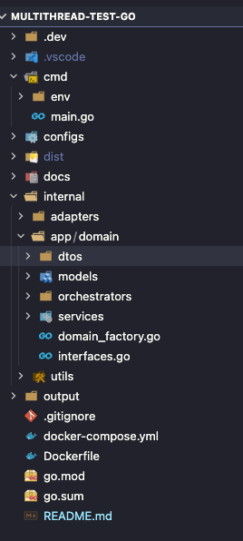

## Multithread Test - Go Version

    Este projeto tem por objetivo analisar vantagens e desvantagens ao utilizar [Golang](https://go.dev/) em processos/rotinas Batch oa invés de Java com [Spring Boot](https://spring.io/projects/spring-boot).

## Pontos Avaliados
    - Performance (tempo de processamento)
    - Consumo de recursos (memória e cpu)
    - Tamanho de Imagem Docker
    - Legibilidade + Manutenibilidade (um pouco subjetivo, deve ser analisado por pares)

## Tecnologias
    - Golang 1.19
    - MySQL ${latest}
    - Docker Engine
    - Docker Compose

## Arquitetura Alvo
    - Domain Driven Design 
    - Arquitetura Hexagonal      


<p style="text-align:center;">https://blog.cleancoder.com/uncle-bob/2012/08/13/the-clean-architecture.html</p>

## Escopo Funcional

    Este projeto FAKE deverá importar dados de usuários do github a partir da API oficial/aberta (ou mockada) para um banco MySQL. O processo de leitura será sequencial ordenado pelo ID do usuário, respeitando o limite de paginação da API. O processo de insert deverá ser executado utilizando threads independentes.
    A quantidade de usuários a ser importada e o limite de threads abertas devem ser parametrizáveis.

## Estrutura de Projeto   


| **Diretório**                     | **Escopo**                                                                                       |
|-----------------------------------|--------------------------------------------------------------------------------------------------|
| cmd                               | package main (executável)                                                                        |
| cmd/env                           | contém arquivos de configuração da aplicação                                                     |
| configs                           | package responsável por carregar configurações e variáveis de ambiente                           |
| docs                              | contém imagens e packages relacionadas a documentação do job                                     |
| internal                          | packages internas da aplicação                                                                   |
| internal/adapters                 | oferece interfaces p/ desacoplar componentes de baixo nível                                      |
| internal/adapters/infra           | oferece recursos/instâncias de componentes específicos de baixo nível                            |
| internal/app                      | delimita escopo funcional e orquestração                                                         |
| internal/app/domain               | domínio                                                                                          |
| internal/app/domain/dtos          | objetos para transportar dados entre as camadas                                                  |
| internal/app/domain/models        | entidades e políticas de negócio com nomenclatura alinhada entre TI e Negócio (Linguagem Ubíqua) |
| internal/app/domain/orchestrators | package que administra e executa os casos de uso (serviços) relacionados ao processo de negócio  |
| internal/app/domain/services      | package com as funções necessárias para suportar a execução do(s) caso(s) de uso                 |
| internal/utils                    | funções de suporte                                                                               |


 

## Execução do job (executar na raiz do projeto)
````bash
docker-compose build && docker-compose up -d
````

    A configuração das imagens fará com que o job sempre "restarte" ao finalizar, possibilitando avaliar os KPIs ao longo da execução.  


    

